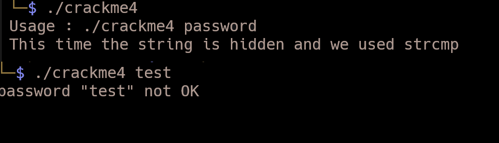

# Crackme2

Program çalışacağı zaman bir parola olarak argüman almaktadır. 

Burada disassembler aracı olarak radare2 kullandım. 

>r2 -d crackme2

komutu ile programı debugger modda (-d parametresi bunun için kullanılır) başlatabiliriz.

>aaa , komutu analizi gerçekleştirir

> afl komutunu kullanarak da fonksiyonları listeleyebiliriz.

Program içerisinde printf(), strcmp() gibi hazır fonksiyonların kullanıldığını söyleyebiliriz. giveFlag() isimli fonksiyon da bulunmaktadır.

Program akışına bakacak olursak,

> pdf@main 

komutu main fonksiyonunun assembly halini gösterir. (pdf=print disassembly at function)

Kullanıcıdan aldığı değer ile super_secret_password değerini karşılaştırmaktadır (call sym.imp.strcmp) . strcmp metodun return ettiği değer eax. içerisinde tutulur ama eax'ın değerini değiştirmez zero flag ZF değerini değiştirir.

> `test eax,eax` 
> `je 0x8048504 # ZF=1 ise verilen adrese gider.` 

Devamında da giveFlag() metodunu çağırır ve program sonlanır.

program içerisinde bulunan string değerini kullanarak çalıştırdığımız zaman flag değerine ulaşmış olduk.

# Crackme3 

Dosyanın stripped olması reversing ve debugging işleminde main fonksiyonun adresini bulma kısmını zorlaştıracaktır. gdb veya ghidra gibi araçlarda fonksiyonlar içerisinde main görünmeyecektir.

> `__libc_start_main` metodun ilk parametresi main() fonksiyonu çağırmaktadır.   

>`PUSH FUN_080484f4` instruction ile main() fonksiyonunun olduğunu anlayabiliriz. 

Aynı zamanda decompile penceresinde de Ghidra aracın oluşturmuş olduğu kodları inceleyebiliriz.

Fonksiyona çift tıklayarak bulunduğu yere gidebiliriz. İçeriği incelendiğinde main() fonksiyon olduğu anlaşılabilir. 

fonksiyon içerisinde parolayı kontrol eden koşulun içerisinde karşılaştırdığı değer base64 ile decode edilmiştir.  Komut satırından base64 aracını kullanarak veya cyberchef aracı ile de decode edilebilir. Ortaya çıkan değer flag değeridir.

# Crackme4

main() içerisinde yeterli sayıda argüman olup olmadığı kontrol edildikten sonra parola doğrulama kısmı compare_pwd() metodu ile başlamaktadır.

ghidra main decompile penceresinde de main kodlarını görebiliriz.

compare_pwd() fonksiyonu içerisinde get_pwd() ile parola değerini çağırır ve kullanıcıdan aldığı değeri karışlaştırır.

get_pwd() metodunda döngü içerisinde bazı işlemler gerçekleşmiş .

Burada get_pwd metodu içerisine girmeden compare_pwd içerisinde parolanın döndürdüğü get_pwd() fonksiyonu ekrana yazdıracak şekilde programı patchledim. Burada parola değeri local_28 adresine yazılmaktadır. compare_pwd() metodu içerisindeki eşitliğin sağlanmadığı else durumunda 

.jpg)

compare_pwd() metodu içerisindeki eşitliğin sağlanmadığı else durumunda kullanıcıdan alınan değer yerine parolayı vermektedir. Kodun son hali şekildeki gibidir.

Sonrasında yapılan değişiklikleri kaydetmek için File -> Export  Program ile dosyayı dışa aktarabiliriz. Programa çalıştırma izni vererek çalıştırıldığında, bize parola değerini verecektir.

# Crackme5

>r2 -Ad crackme5

komutu ile debug modda programı radare2 ile başlatıyoruz.

> afl

ile içerisindeki fonksiyonlar listelenir. Daha detaylı analiz yapılarak farklı fonksyionlar bulunabilir.

>pdf @ main 

main fonksiyonunu inceleyelim. Başlangıçta bazı değişkenler tanımlanmış

programın ilerleyen kısmında kullanıcıdan input istiyor. Alınan değeri başka birdeğer ile karşılaştırıyor ve sonuca göre koşullar çalışıyor.

strcmp_ fonksiyonun parametrelerinin (rsi,rdi) şeklinde olduğu görülebilir. 

>`0x0040082f call sym.strcmp_`  breakpoint koyalım. dc komutu ile programı çalıştıralım.

İstenen inputu girdiğimiz zaman strcmp_ fonksiyonun çağrıldığı adreste duracaktır. rsi ve rdi registerlarının içerisindeki değer ps(print string) komutunu kullanarak görülebilir.

hexdump görüntülemek istersek px komutu kullanılabilir.

Not: rsi(register source index) ve rdi(register destination index) 

>`0x00400821      488d55d0       lea rdx, [var_30h]`
> `0x00400825      488d45b0       lea rax, [var_50h]`
> `0x00400829      4889d6         mov rsi, rdx`
> `0x0040082c      4889c7         mov rdi, rax`
> `0x0040082f     e8a2feffff     call sym.strcmp_`

Aslında stack içerisine bakıldığında var_30h değeri parola değerini tutuyor. Adres olarak rbp-0x30.  Gelen input ise edi ile alındıktan sonra var_50h üzerine yazılıyor ve adresi rbp-0x50.

# Crackme6

ghidra aracı ile birlikte açtığımız zaman main içerisinde compare_pwd() fonksiyonu ile girilen parola değerinin doğrulaması yapıldığı görülecektir. Doğrulama yapılırken my_secure_test isimli metot kullanılmaktadır. Burada yapılan işlem, girilen parola değerinin her bir karakteri belirli değerlere eşitliği kontrol edilir.

# Crackme7

Programa geçersiz inputlar verildiğinde farklı uyarılarda bulunmaktadır.

Main fonksiyon içerisini incelediğimiz zaman seçenek 3 için iki farklı koşul bulunmaktadır. 
> `cmp eax, 3`
>`jne 0x8048662` 

girilen değer 3'e eşitse "Goodbye" mesajını ekrana yazar ve programdan çıkar. Burada jne, eşitliğin sağlanmaması diğer bir deyişle zero flag set edilmediği durumda çalışır. jump edilen adres takip edildiğinde

> `cmp eax, 0x7a69 # decimal değeri 3117 ile eşitliği kontrol edilir`

Eğer eşitse, ilerleyen kod satırında giveFlag() metodunu çağırmaktadır.

Bu işlem ghidra gibi diğer araçlarla daha kolay anlaşılabilir. Main içerisinde flag değerini veren if bloğu görseldeki gibidir.

Bulunan değer girildiğinde flag değeri elde edilir.

# Crackme8

Main içerisinde kullanıcıdan alınan parola değeri atoi ile string bir değeri integer tipine dönüştürmektedir. Bu değer ile verilen hexadecimal değeri karşılaştırmaktadır. Diğer araçlarda, 

> `cmp eax, 0xcafef00d` 

olarak gösterilebilir. Bu değer, signed decimal olarak çevrildiğinde -889262067 olmaktadır.

Bulunan değer input olarak girildiğinde flag değerine ulaşılmaktadır.

# Kaynak
- https://refspecs.linuxbase.org/LSB_3.1.0/LSB-generic/LSB-generic/baselib---libc-start-main-.html
- [Liveoverflow-Finding main() in Stripped Binary - bin 0x2C](https://www.youtube.com/watch?v=N1US3c6CpSw)

