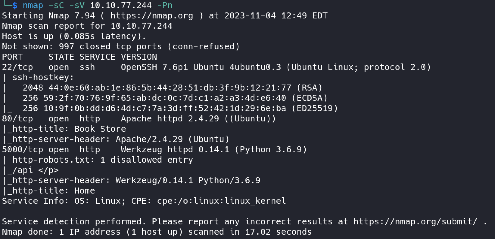

TryHackMe oda adresi : https://tryhackme.com/room/bookstoreoc

Web uygulamalarında dizin taraması, API parametre fuzzing, yerel yetki yükseltme  (local privilege escalation ) gibi işlemlerin yanı sıra temel seviye bir elf dosyasının reverse edilmesi gibi konuları içeren bir challange.

Makineyi başlattıktan sonra hedef IP adresine nmap taraması gerçekleştiriyoruz.

Burada 80 portunda web uygulaması 5000 port numarasında ise REST API çalışmaktadır. Python Flask framework kullanıldığı anlaşılabilir servis isminden. robots.txt dosyası içerisinde de /api dizini izin verilmeyen kayıtlar arasında. 

http://IP-ADRESİ:5000/api adresinde API dökümantasyonu bulunuyor.

Burada dizin taraması yaparak da ilerleyebiliriz. Web enumeration aşamasında uygulamanın erişebildiğimiz gizli veya yayınlanmış dizinleri, dosyaları ne kadar fazla keşfedebilirsek saldırı yüzeyimiz o kadar genişlemektedir.

Werkzeug debug mode açık olduğundan dolayı /console dizinine erişim sağlayabiliyoruz ancak pin korumalı. 0.14.1 eski versiyonu kullanıldığından dolayı zafiyetli olma olasılığı yüksek.

80.port üzerinde çalışan web uygulamasına bakıyorum. Sayfaların kaynak kod içerisinde yorum satırlarında ipuçları bırakılmış.

cyberchef aracını kullanarak encode edilmiş metin çözüldüğünde bir youtube video bağlantı adresi olduğunu tespit ettik.

Verilen bağlantıya gidildinde Stick bug isimli bir video ile karşılaşıyoruz.

Kaynak kodlar içerisini kontrol ederken tekrardan bir ipucu daha elde ediyoruz. login.html sayfasında debugger pinin bash history dosyasında olduğunu söylüyor.

api servisine dönelim. Dökümantasyon içerisinde olmayan id veya author dışında başka yollar olabilir. Ayrıca /api/v2/ olarak belirtilmiş versiyon 1 aktif mi onu da kontrol edebiliriz.

Her iki versiyondan da başarılı bir response dönmekte. Bu iki api versiyonu için fuzzing yapalım.

Fuzzing sonucu, /api/v1 için farklı bir değer ortaya çıktı. Bulunan parametre ile API'ye istek gönderildiğinde hata sayfası çıkmaktadır.

Bu parametre bir dosya ismi istiyor. Klasik, bilinen yerel dosyalardan /etc/passwd dosyasını girdi olarak yazıyorum. Yerel dizindeki dosyaları okuyabiliyor. Local File Inclusion zafiyeti bulunuyor. Home dizini /home/sid

user.txt bu dizin içerisinde.

Aynı zamanda API v1 içerisinde LFI zafiyetinin bulunması ile ilgili bir ipucu api.js dosyasının içerisinde de verilmektedir.

Bu aşamadan sonra bulunması gereken console pin kodu. Bununla ilgili ipucunu bulmuştuk. bash history dosyası içerisinde olduğu söylenmişti. Bu dosya terminal üzerinde komut geçmişini kaydediyor.

?show=/home/sid/.bash_history şeklinde istek attığımız zaman API dosya içeriğini response olarak dönmektedir.

/console dizinine pin kodunu girdikten sonra python konsoluna erişim sağlıyoruz. Hedef üzerinde çalışan bir konsol üzerinden reverse shell bağlantısı kuralım. Bunun için python kullanarak alınan shell bağlantısı koduna ihtiyacımız var.

Reverse shell payloadını console içerisinde çalıştıralım.

shell almış olduk ancak /root içerisindeki root.txt dosyasını okumak için yeterli izin yok. Yetki yükseltmek için önemli bir nokta olan suid bit set edilmiş bir dosya bulunmaktadır. SUID bit set edilmiş komut veya dosya yetkisiz kullanıcının root olmasına yardımcı olur.

SUID biti set edilmiş binaryleri listelemek için kullanılan bir yöntem görseldeki gibidir. Yetki yükseltmek için burada listelenen komutları da deneyebiliriz. Bunun için [GTFOBins](https://gtfobins.github.io/) kaynağını kullanabiliriz. 

try-harder isimli dosyayı kullanarak yetki yükseltme işlemi gerçekleştireceğim. Bundan önce su, sudo gibi komutları denedim ancak başarılı sonuç alamadım. Dosyayı kendi makineme yüklüyorum.

radare2 aracını kullanarak açtım ve analizini gerçekleştirdikten sonra ana fonksiyonun olduğu kısma geldim. Reverse işlemine başlamadan önce uygulamayı çalıştırabiliriz.

Burada kullanıcıdan bir sihirli numara girmesini istiyor ve girilen sayı var_14h değerine alınıyor. Bu input,  0x1116 değeri ile xor işlemini gerçekleştiriyor.
`mov eax, dword [var_14h]`
`xor eax, 0x1116`

Sonraki işlemler incelendiğinde elde edilen sonuç var_10h = 0x5db3 değeri ile tekrardan xor işlemine tabi olunuyor ve sonuç 0x5dcd21f4 değerine eşitse /bin/bash -p olarak yetkili bir şekilde shell açılıyor.
`mov dword [var_ch], eax`
`mov eax,dword [var_10h] ; eax=var_10h=0x5db3`
`xor dword[var_ch], eax`
`cmp dword[var_ch], 0x5dcd21f4`
`jne 0x823 ; jump if not equal var_ch and 0x5dcd21f4` 

Benzer şekilde, ghidra ile decompile edilmiş assembly kodlarını görebiliriz.

xor işleminin tersi yine kendisidir yani elimizde olan diğer sayıları xor işleminden geçirirsem vermem gereken sayıyı tespit edeceğim. Python3 içerisinde bu xor işlemi için "^" sembolü kullanılmaktadır.

./try-harder programı için doğru numara değerini verdiğimiz zaman root kullanıcısı olduk. /root dizinine erişim sağlayabiliriz.

# Kaynaklar
* https://www.hackingarticles.in/linux-privilege-escalation-using-suid-binaries/
* https://gtfobins.github.io/
* https://book.hacktricks.xyz/network-services-pentesting/pentesting-web/web-api-pentesting
